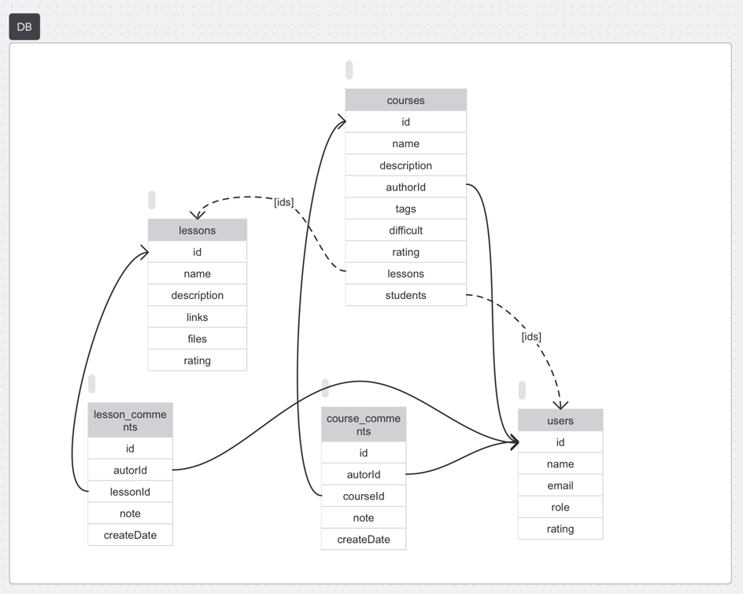
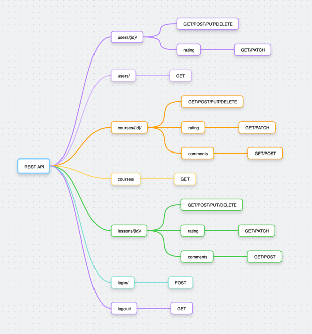

### Best Courses Ever

Основная цель предоставить пользователям доступ к курсам.
Автор создает курс и занятие к нему, прикрепляет ссылки и видео, добавляет описание.
Отмечает пользователей у которых есть доступ к данному курсу.
Пользователи могу просматривать описание, рейтинг, теги и комментарии всех курсов,
при добавлении в список пользователей курса, пользователь видит набор занятий и материалы
курса, может выставлять рейтинг курсам и занятиям и оставлять комментраии в них.

#### Предварительная схема БД

#### Предварительная схема  API
